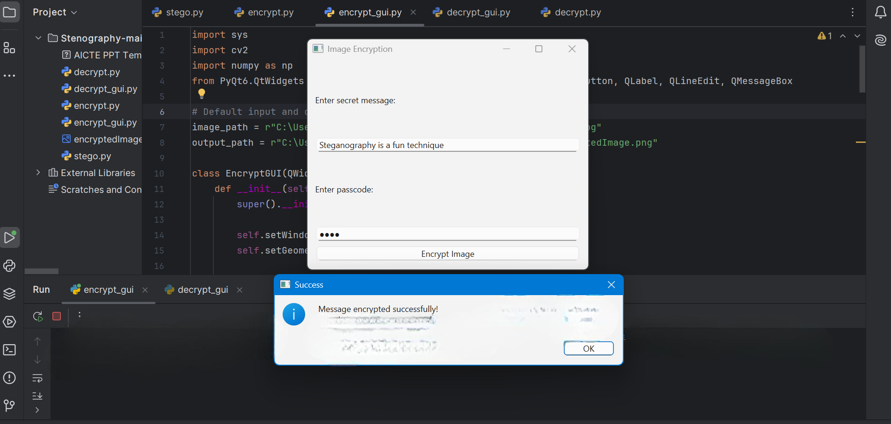
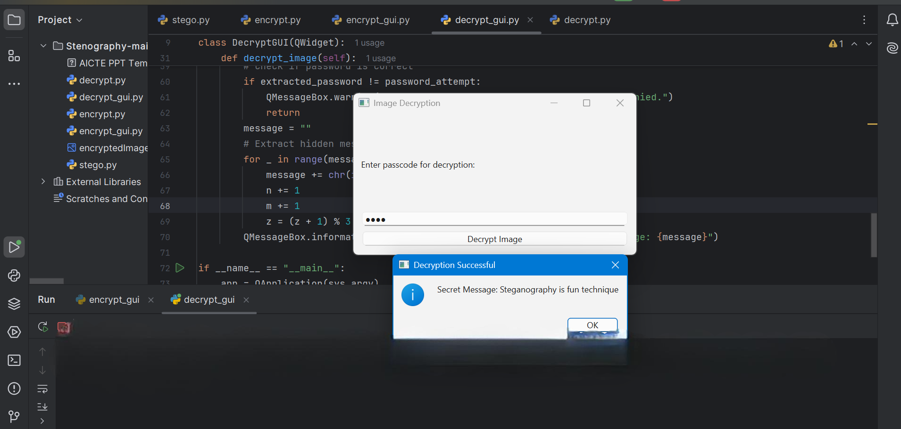

# Secure Data Hiding in Images using Steganography

## Project Overview
This project provides a secure and user-friendly way to encrypt and decrypt messages within images using steganography and password protection. The message is embedded inside an image using OpenCV and can only be retrieved with the correct password.

## Technologies Used
-   NumPy   – Array manipulation
-   PyQt6   – Graphical User Interface (GUI)
-   Python   – Programming language
-   OpenCV   – Image processing

## Features
  Graphical User Interface (GUI)   – Easy-to-use interface.  
  No need for external storage   – The message is stored directly in the image.  
  Works with PNG images   – Saves encrypted images in lossless format.
  Steganography-based encryption   – Hides messages within image pixels.  
  Password-protected decryption   – Ensures secure message retrieval.  

## Installation
1.   Clone this repository:    
   ```bash
   git clone https://github.com/Neeraj8603/Secure-Data-Hiding-in-Image-Using-Steganography
   cd Secure-Data-Hiding-in-Image-Using-Steganography
   ```
2.   Install dependencies:    
   ```bash
   pip install opencv-python numpy PyQt6
   ```

## Usage
### Encrypt an Image
1. Run the encryption script:
   ```bash
   python new_encrypt_gui.py
   ```
2. Enter the   secret message   and   password  .
3. Click on   Encrypt Image  , and it will generate an encrypted image.

### Decrypt an Image
1. Run the decryption script:
   ```bash
   python new_decrypt_gui.py
   ```
2. Enter the   password   used during encryption.
3. If the password is correct, the   hidden message   will be revealed.

## Future Scope
 Development of a   mobile and web application    
 AI-based   image security and tampering detection    
 Support for   multiple image formats   (JPG, BMP, etc.)  
 Implementation of   AES encryption   for extra security  

 ## Screenshots

### Encryption Process


### Decryption Process



## GitHub Repository
(https://github.com/Neeraj8603/Secure-Data-Hiding-in-Image-Using-Steganography)

